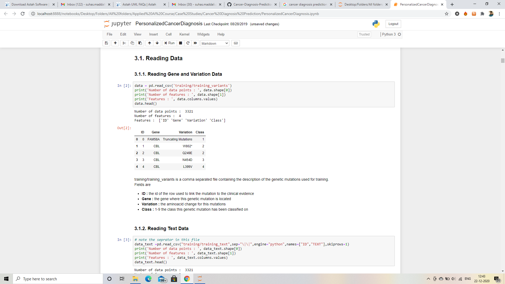
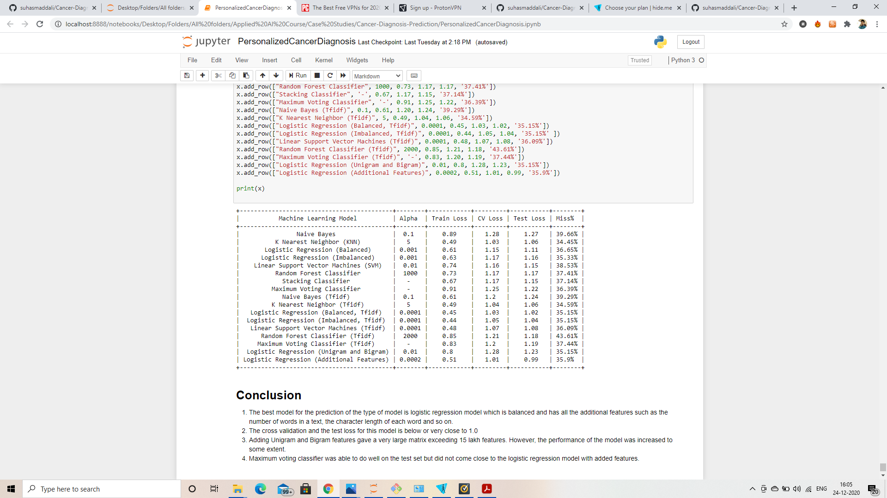

# Cancer Diagnosis Prediction
## 1.1 Introduction
This project was developed with the help of AppliedAI team based in India. 

Based on the given set of features such as gene, mutation and text associated with a given data, the machine learning models would predict the type of cancer that a person would have under 9 classes. 

The machine learning models that were used in the process of prediction were K Nearest Neighbors, Linear Support Vector Machines (SVM), Logistic Regression, Stacking Classifer, Voting Classifier and Random Forests Classifiers. 

Given a set of input features such as gene, the type of mutation and the text that is associated with the gene and the mutation, the machine learning model could classify the chances of a person to suffer from cancer. In addition to this, it would also give an indication of the type of class of the cancer from 1 to 9. 

## 1.2 Metrics
We have to be looking at different metrics in the problem before diagnosing the solution. We would be looking for some metrics such as log loss, accuracy and so on for different models and add those in tables so that we would be better able to decide the right kind of algorithm for the problem. 

## Table of Contents
### 1. Cancer Diagnosis Prediction 
##### 1.1 Introduction
##### 1.2 Metrics
### 2. Analysing the data
##### 2.1 Reading the data 
##### 2.2 Preprocessing the text
##### 2.3 Dividing the data 
##### 2.4 Distribution of data 
##### 2.5 Using Random Model 
##### 2.6 Precision and Recall 
##### 2.7 Histogram 
### 3. Machine Learning Models 
##### 3.1 Naive Bayes
##### 3.2 K Nearest Neighbors (KNN) 
##### 3.3 Logistic Regression
##### 3.4 Support Vector Machines (SVM) 
##### 3.5 Random Forest Classifier 
### 4. Conclusion 

## 2.1 Reading the data
We would be reading the csv (comma separated file) data and loading the data into a variable. We would then we preprocessing the data and converting the entire data in the form of mathematical vectors. These vectors could be given to the machine learning model for analysis and the output. 

We have a file that contains 3321 data point and 4 features. We are given the ID, Gene, Variation and Class of cancer. For more information to read the description, you can open the actual python notebook file where everything is described fully. 

.png)
Here, we could see that the number of points that we have taken into consideration are 3321. We have just 2 features with the file that we have taken namely the ID and the Text associated with it. We see just 5 rows just to consider the head of the data frame. 

## 2.2 Preprocessing the text 
.png)
We would be preprocessing the text and converting it into a mathematical vector so that those values could be given to the machine learning model. We first take into consideration the stop words which are very important in english. Later, we would be removing every special character as they do not give much meaning to the text. Here, we are removing characters apart from a-z, A-Z and 0-9. In addition to this, we are lowecasing the words and removing all the stop words such as "the",   "and" and so on. We also must delete the rows that do not contain any text. The code in the second cell would do exactly do that. We would be printing the id number of the row that does not contain any text. If a row contains text, we would store those valeus in a new variable.

## 2.3 Dividing the data 
.png)
We would be dividing the whole data into train, cross validation and test set respectively. We must ensure that the machine learning model must do well not only on the cross validation set but also the test set. Thus, we would be dividing the entire data into train, cross validation and test set. 
After dividing, we see that the total number of points on the training data are 2124. The number of data points on the test data are 665 and the points in the cross validation data is 532. 
## 2.4 Distribution of data
.png)
We could see from the diagram that most of the data points in the training data contain class 7 as their output. We are able to see the distribution of the data with respect to the class of cancer. 
When we see the distribution of the classes on the test data, we also see that most of the test data contain output as class 7. Therefore, histograms could be used to see how the data is distributed. 
## 2.5 Using random model 
.png)
We would be first using a random model as our initial model which could be used as a benchmark for the other machine learning models. If a machine learning model has a log loss higher than the random model, it would be better not use that model as it does not even perform better than a random model which gives random set of values of y for prediction. We are also using a confusion matrix where on the y axis, we have the actual class and on the x axis, we have the predicted class. Ideally, we must have a diagonal line between the predicted class and the actual class so that there is no misclassification between classes. 
.png)
## 2.6 Precision and Recall 
We must also take into consideration precision and recall as they are some of the important metrics which we cannot take for granted. Accuracy cannot be a reliable metric to evaluate the performance of a machine learning model in classification problems. For example, if we have a test set that contains only one output (either 1 or 0) and we use a model that would return just one value without performing machine learning operations, the accuracy of the model would be high if we consider it as a metric. However, the model does not perform any machine learning operations but just returning 1 or 0. Thus, we can say that accuracy is not the best reliable metric for classification problem. After considering recall and precision, however, we could evaluate the model much better. The diagram shows precision and recall confusion matrix respectively. 
## 2.7 Histogram 
.png)
We would also take a look at the index of genes that are associated with the data. Here, we find that as the index of the gene increases, their frequency decreases. We are plotting a histogram just to see how the data is spread. 
/png)
We are also plotting the cumulative distribution of genes so that we take into consideration the frequency of the genes and add them with different types of genes to get a clear picture. 

## 3.1 Naive Bayes
.png)
We choose different values of alpha to check how well the model does on the test set. We can see that in the training phase, we tend to see that the model does very well for the alpha value of 0.1 and we might conclude soon that this is the best value of alpha for naive bayes. There might be chances, however, that the model is overfitting to the training data and it does not perform well on the test data as a result of high variance. Therefore, we must also check the log loss for the test set. At the bottom, we see that the best value of alpha is 0.1 as it not only reduces the log loss for the training set but also for the cross validation and the test set. By looking at the graph, therefore, we can conclude that the best value for the naive bayes classifier is 0.1 respectively. 

.png)
Now, we would be testing the model with the best hyperparameters, in our case being 0.1 for the alpha value. We use a multinomial naive bayes classifier and use the training set with the labels to it. We use predict the probabilities rather just just get a discrete 1 or a 0. We see that the log loss for the model is 1.28 (approx) respectively. We also see that the misclassification rate of the model with alpha being equal to 0.1 is 0.39 (approx). We can conclude that the model was able to predict the output for the test set accurately 60 percent of the time which is not bad when we look at the complexity of the problem at hand. 

.png)
We see the confusion matrix in the image above. We can see that most of the values for the test set belongong to class 1 were predicted to be class 1. We could see 58 such points. In addition to this, we also see that the naive bayes model was able to accurately predict the class 7 as there are a lot of correctly classified points for class 7 as can be seen in the confusion matrix. Nonetheless, there are a few misclassifications such as the class belonging to 7 but model predicting it to be 2. We can also see that the class that is actually 2 is predicted to be class 7. We understand from this information that there is a confusion for the model in terms of predicted class 2 and class 7. Therefore, we'll have to address this issue by using other machine learning models later and then, come to a conclusion. 

.png)
We see the precision and recall of the matrix and we used a confusion matrix just to see how well the model did in terms of these metrics. Precision gives us what proportion of the true positives identifications were actually correct. On the other hand, recall gives us the proportion of actual positives that were identified correctly. 

.png)
We find an interesting image above. We see some of the important words those really helped the model in predicting the class. We find that these are the key words for specific classes to be true. Thus, the naive bayes model would use its ability to classify text and see if these words are present to come to a conclusion that there is a possibility of a patient suffering from cancer with class 4. 

.png)
We also see from the image that there are a few points that are incorrectly classified. We find that these points were classified incorrectly due to the presence of a few words that were the deciding factors for the algorithm to conclude incorrectly. This might be due to these same words being present in different classes, leading to the confusion of the machine learning naive bayes model. We can also see the predicted probabilities of the model for each class and then determining based on the mathematical value, the class of cancer. 

## 3.2 K Nearest Neighbor
.png)
We would be looking at an alternative model called K nearest neighbour. In this algorithm, we would be deciding the hyperparameter k which is nothing but the number of nearest neighbours which would be used for the prediction of the class of cancer. Therefore, we would be doing hyperparameter tuning and getting the accuracy of the model for different values of alpha before coming to the conclusion. We can see from the image that for the value of alpha = 5, we get the best accuracy for the training set. However, we are not sure whether the same model would be able to get the best accuracy for the test set. It turns out that the model is not overfitting and we are able to select the best value of alpha. For the value of alpha = 5, we are able to get the log loss in the test set to be 1.06 (approx) respectively.  

.png)
We have used the value of alpha = 5 for predictions for the unknown data set (test set). We see that the log loss is 1.03 (approx) respectively. In addition to that, the misclassification rate is about 0.34 (approx) respectively. This model performed better than the Naive Bayes Model that we have considered above. It is able to predict about 66 percent of the times the type of cancer that a patient can have depending on the text and the gene associated with it. 

.png)
We have plotted the confusion matrix just to see how the predicted values and the actual values intersect. We see that the model is able to very accurately classify the chance of a cancer of class 7 as we can see in the image above. We also see that it is slightly better in terms of predicting the chances of a cancer with the class 4. However, there are a few instances where the model has misclassified. For example, when we look at the actual class 2, the model mostly predicted them to be class 7. Therefore, this model might not be the best model yet as it is misclassifying the class 2 with class 7. 

.png)
We have also plotted the precision and recall matrix for the K nearest neighbor algorithm. We see that there is a smooth diagonal in the case of precision matrix. In the recall matrix, however, we see that there is a bit of a misclassification for the class 8 which was classified as class 7. 

## 3.3 Logistic Regression
.png)
We are currently using logistic regression model. Here we could see that there are small values to large values of alpha so the range of alpha values is large. We would be testing the log loss with different values of alpha for the training set and see how well the model does on the test set. We see that for the value of alpha = 0.001, the train log loss is about 0.69 respectively. Moreover, the model does not overfit in the case of the value of alpha being equal to 0.001 respectively. We see that the log loss for the cross validation and test set is 1.15 (approx) and 1.11 (approx) respectively. Therefore the log loss is pretty low for this model. 

.png)
We would now be testing the output with the value of alpha being equal to 0.001 respectively. We find that the log loss for the test set is equal to 1.15 and the misclassification rate is about 36 percent. Therefore, the model is able to accurately predict the type of cancer in a patient with an accuracy of about 66 percent. We see in the confusion matrix that the class that belongs to class 2 is still being predicted to be class 7. We could not completely eliminate this error in the output with the change to logistic regression model. The model performed well overall in terms of precision and recall. However, there are a few more things that the model should be before becoming a perfect model. 
.png)
We see the precision matrix and recall matrix in the above diagram. We can say that it is doing pretty well in both with a few points being misclassified. In addition, we see that the model was able to perform well on the test set in both the precision and recall and there is no value of 0 in terms of predicted class 8 which implies that it is a good model. 

.png)
We would also be looking at the correctly classified points and understand the features present in the text that made them correctly classified. Therefore, we could be able to also interpret the model and the model is transparent to a large extent as we are able to see the features that made the output correct.
.png)
On the other hand in the above diagram, we see there are some incorrectly classified points. We see that due to the presence of a few features and words in the text, the model was not able to classify accurately the actual output. Therefore, we would look at these features and understand them so that in the future, we might either modify the values so that they give the correct output. 
## 3.4 Support Vector Machines (SVM)
.png)
We use a classifier known as linear support vector machines. Here we find the values of C to get the best output. We have taken the values of C range to be large so that we see the deviation from the output and select the best hyperparameter. We find the best value of C is 0.0001 both on the trainig set and the test set. We find that with this value, the model does not either overfit or underfit. We can conclude that the model is doing well with the value of C being equal to 0.0001 respectively. 
.png)
We have also plotted the precision and recall for the linear support vector machines model. We see that the model does well in classifying most of the classes of cancer accurately. However, it is still not that good in terms of clasifying the class 2 as it is confused and is misclassifying it to be class 7. 
.png)
We would also be taking a look at the feature importance and see to it as to why the classification is done depending on the features. We see that there are a few features that led the algorithm to correctly predict the output. Thus, we must also take these features into consideration when we are trying to reduce the dimensions of the matrix that we are giving to the machine learning model. 
.png)
We would also consider the incorrectly classified points and see the features that were responsible for the algorithm to misclassify. We see a few features that were responsible for the algorithm to not classify correctly. We were able to understand the features and we can try to eliminate or modify those features so that the algorithm would perform better by using feature engineering.
## 3.5 Random Forest Classifier
.png)
We would now be using the random forest classifier. Here, we would consider the depth of the tree as the hyperparameter and decided the values of it such that the model does not overfit or underfit. We would be printing the log loss values for specific values of the depth of the tree. 
.png)
We can see from the image that the number of estimators when equal to 2000 would give the best results for the cross validation and the test set. We get a value of about 1.18 for the test set respectively. Therefore, we would be using that value for the prediction of the output. 
.png)
We see that the misclassification rate is about 0.43 respectively. What this means is that the model is able to accurately predict the type of cancer with an accuracy of about 57 percent. We see that this model does not perform as well as the models that we have seen above. But it would be better to see where there are mistakes just to get an understanding of how the algorithm performed. There is again some misclassification of the class points that belong to class 2. They were again predicted to be class 7 which is a mistake. We also see that most of the class 7 points were accurately predicted. In addition, we see that there is a misclassification of the points which belong to class 4 but were classified as class 1. This trend is not followed by the previous classes and this accounts to mostly the misclassification. 
.png)
We also see the precision and recall matrix of the random forest classifier for cancer diagnosis prediction data set. We see that there are a few values which are blank. Therefore, we can tell that out of all the points that contain class 3 and class 8 as the output label, it was not able to accurately classify one positive case correctly. Therefore, this model cannot actually predict the presence of cancer of class 3 and class 7 as can be seen in the precision matrix. However, there is not a big problem with the recall matrix. We see that the model did quite well in terms of the recall matrix respectively. 
.png)
We see that there are a few features that were responsible for the model to predict the classes and we see them in the above image. We could get a rough idea about these features and understand why the algorithm gave a class. Therefore, there is feature importance for random forest classifier. 
.png)
We see that there are few incorrectly classified points and we find a few features that were as a result of the incorrectly classified points. 

## 4.1 Conclusion 
We see in the table above that there are a few modifications to the data and adding specific features to improve the accuracy of the model. We find that K Nearest Neighbours (KNN) performed the best compared to the other models without adding any new features to the datat set. We also see that we have added tfidf vectors to the text. We see that for the linear support vector machines with the addition of the TFIDF vectors, we find there is a reduction in the error by about 2 percent compared to the svm without tfidf vectors. We also see there is a reduction in error when we add the tfidf vectors for the logistic regression model. 

